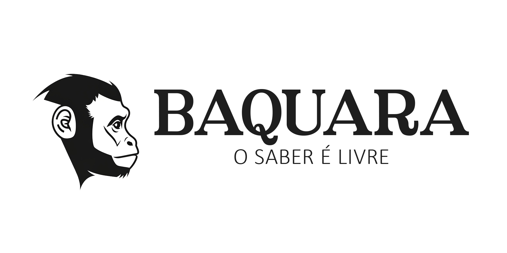

# Baquara

  

---

## Sobre o Projeto

Fundado em 2026, o Baquara é uma iniciativa voltada à organização e disponibilização de conteúdos educacionais gratuitos na internet, com foco principal em videoaulas.

Vivemos em uma era de abundância informacional, mas o acesso qualificado ao conhecimento ainda é um desafio. O Baquara surge como uma resposta a esse cenário: estruturar, catalogar e tornar navegável o conteúdo gratuito já existente, além de possibilitar a produção colaborativa de materiais educativos dentro da própria plataforma.

Todo conteúdo disponibilizado no Baquara é gratuito para o usuário final.

---

## Objetivos

- Reduzir barreiras de descoberta de conteúdo educacional gratuito
- Estruturar caminhos claros de aprendizado
- Promover organização e curadoria responsável
- Estimular colaboração voluntária na produção de conhecimento
- Desenvolver uma infraestrutura digital ética e transparente

---

## O que o Baquara não é

- Não é uma rede social
- Não é um marketplace
- Não é uma plataforma orientada por retenção de atenção
- Não utiliza mecanismos de manipulação algorítmica

O foco está na clareza, simplicidade e autonomia do usuário.

---

## Modelo de Conteúdo

O Baquara atua em duas frentes:

1. **Catalogação de conteúdo gratuito externo**
   - Organização de materiais já disponíveis publicamente
   - Créditos e redirecionamento para criadores originais

2. **Produção colaborativa interna**
   - Conteúdos desenvolvidos voluntariamente
   - Exclusivos da plataforma
   - Não monetizados

Iniciativas pagas podem coexistir fora da plataforma.  
Dentro do Baquara, o acesso será sempre gratuito.

---

## Estrutura Técnica (em desenvolvimento)

Backend: Django  
Banco de dados: PostgreSQL  
Frontend: Django Templates + HTMX  
Infraestrutura: Docker  

Status: Projeto em estágio inicial

---

## Como Contribuir

O Baquara é um projeto comunitário em construção.

Você pode contribuir:

- Sugerindo melhorias via Issues
- Propondo novas funcionalidades
- Reportando problemas
- Contribuindo com código
- Participando da discussão conceitual do projeto
- Produzindo conteúdo educacional voluntário

---

## Licença

Este projeto está licenciado sob a licença AGPL-3.0.

---

## Visão de Longo Prazo

O Baquara busca se consolidar como uma fundação digital voltada à organização do conhecimento aberto, contribuindo para ampliar a autonomia intelectual e o acesso à educação.

---
